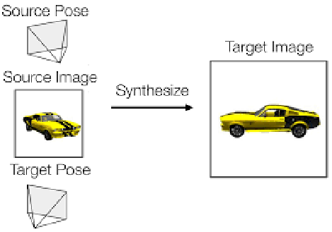
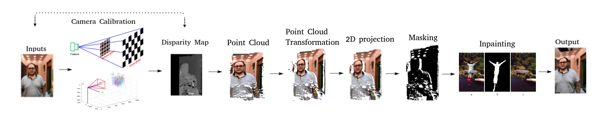

[](https://opensource.org/licenses/mit-license.php)

# Novel-view-generation
## Description about the project  
This project is the implementation of a [**novel view systhesis**](./Project-report:Novel-view-generation.pdf) which aims to generate/systhesize a target view with an arbitrary camera pose from a given source view and its camera pose as shown in figure below[1].

<p align="center">
    
</p>

## Overarch of the proposed method
<p align="center">
    
</p>

## Requirements  
- Python 3.x
- [Open3D](https://pypi.org/project/open3d-python/)
- [OpenCV](https://docs.opencv.org/master/d2/de6/tutorial_py_setup_in_ubuntu.html)
- [Matplotlib](https://pypi.org/project/matplotlib/)
- [Pillow](https://pypi.org/project/Pillow/)
- [NumPy](http://www.numpy.org/)
- [MATLAB](https://in.mathworks.com/products/matlab.html)

## Usage  

### Generating a novel view from scratch
Calibrate the camera
```bash
$ python calibrate.py
```
Then to generate the point cloud
```bash
$ python disparity1.py
```

After this, the point cloud is generated, which needs to be transformed(rotated to the target view). To do this, head over to MATLAB, and run the [pcd_transformation.m](./pcd_transformation.m)  
You now have the transformed point cloud of the target view.  
This point cloud further needs to be projected to 2D. To do this,  
```bash
$ python 3D_to_2D_open3d_part2.py
``` 
After the point cloud is rendered to 2D, a respective mask needs to be generated to perform Inpainting  

```bash
$ python mask_generator.py
```
```bash
$ python Inpainting.py
```

After this stage, we now have the inpainted image, which is the target view of the given input image.   

Check out some other work in novel view synthesis

- [Multi-view 3D Models from Single Images with a Convolutional Network](https://arxiv.org/abs/1511.06702) in CVPR 2016
- [View Synthesis by Appearance Flow](https://arxiv.org/abs/1605.03557) in ECCV 2016
- [Transformation-Grounded Image Generation Network for Novel 3D View Synthesis](https://arxiv.org/abs/1703.02921) in CVPR 2017
- [Neural scene representation and rendering](http://science.sciencemag.org/content/360/6394/1204) in Science 2018
- [Weakly-supervised Disentangling with Recurrent Transformations for 3D View Synthesis](https://arxiv.org/abs/1601.00706) in NIPS 2015
- [DeepStereo: Learning to Predict New Views From the World's Imagery](https://arxiv.org/abs/1506.06825) in CVPR 2016
- [Learning-Based View Synthesis for Light Field Cameras](http://cseweb.ucsd.edu/~viscomp/projects/LF/papers/SIGASIA16/) in SIGGRAPH Asia 2016  
- [Novel View Synthesis in TensorFlow](https://github.com/shaohua0116/NovelViewSynthesis-TensorFlow)


References   
[1] Multi-view to Novel View: Synthesizing Novel Views with Self-Learned Confidence,Sun, Shao-Hua et. al.,2018]  

## Authors  
[Nikhil A](https://lucciffer.github.io/)  
[Praveen C](https://github.com/praveensc319)  
[Jagadish B](https://github.com/jagadishb1409)   
[Vijayalaxmi P](https://github.com/vijupatil)  
